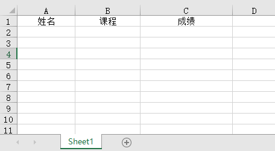
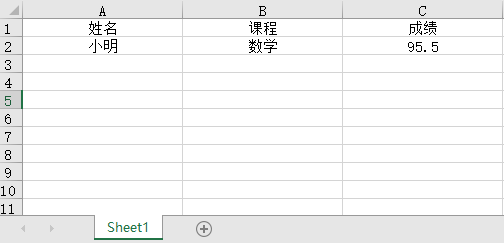
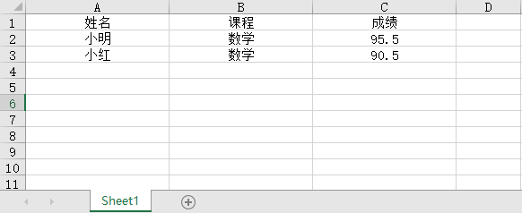
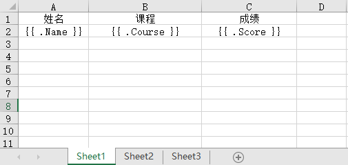
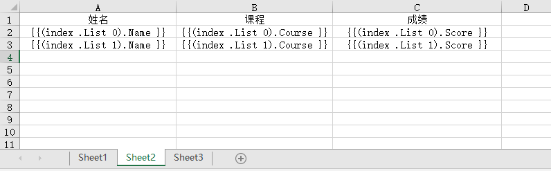
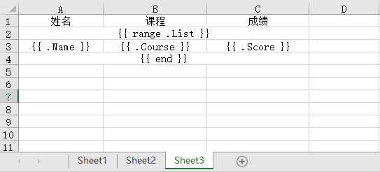
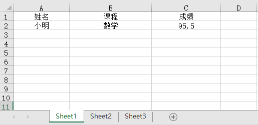
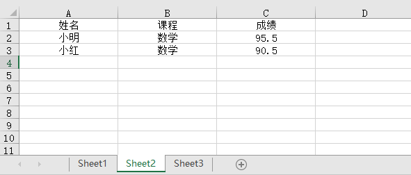
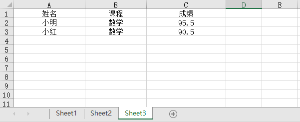
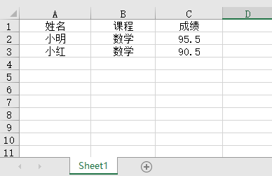

## 一. 概述
对 [Excelize](https://github.com/qax-os/excelize) 进行了简单的封装，方便的读取Excel文件和Excel文件里面写入数据，大部分情况下，定义好结构体就行， 而不需要在代码里面指定各种坐标，让代码难以维护和阅读
> 行和列从1开始算

## 二. 字段标签
| 标签名      | 说明                                                                             |
| ----------- |--------------------------------------------------------------------------------|
| axis      | 指定单元格坐标，不指定时，默认为字段在结构体的顺序，如为结构体的第一个字段，则列的坐标为A，第一列                              |
| style   | 指定单元格样式，excelize.Style{}序列化后的json字符串，参考文档：https://xuri.me/excelize/zh-hans/style.html |
| column   | 指定列名，用于 SetRowsValueByTableHeader方法，根据表头的列名来匹配对应的列坐标                           |
| colWidth   | 指定列的宽度                                                                         |

## 三. 例子
### 1. 写入一个结构体数据
#### 1.1 输入


#### 1.2 代码示例
```go
package main

import "github.com/guidoxie/xlsx"

// Student Name写到A1, Course写到B2， Score写到C2列宽20，单元格居中
type Student struct {
	Name   string  `xlsx:"axis:A2;colWidth:20;style:{\"alignment\":{\"horizontal\":\"center\"}}"`
	Course string  `xlsx:"axis:B2;colWidth:20;style:{\"alignment\":{\"horizontal\":\"center\"}}"`
	Score  float64 `xlsx:"axis:C2;colWidth:20;style:{\"alignment\":{\"horizontal\":\"center\"}}"`
}

func main() {
	f, err := xlsx.OpenFile("template.xlsx")
	if err != nil {
		panic(err)
	}
	if err := f.SetCellByStruct("Sheet1", Student{
		Name:   "小明",
		Course: "数学",
		Score:  95.5,
	}); err != nil {
		panic(err)
	}
	if err := f.SaveAs("set_cell_by_struct.xlsx"); err != nil {
		panic(err)
	}
}
```
#### 1.3 输出


### 2. 写一行数据

#### 2.1 输出


#### 2.2 代码示例
```go
package main

import "github.com/guidoxie/xlsx"

func main() {
	f, err := xlsx.OpenFile("template.xlsx")
	if err != nil {
		panic(err)
	}
	// SetCursor 设置游标，从第二行开始写
	if err := f.SetCursor("Sheet1", 2).SetRowValue("Sheet1", []interface{}{"小明", "数学", 95.5}); err != nil {
		panic(err)
	}
	if err := f.SaveAs("set_row_value.xlsx"); err != nil {
		panic(err)
	}
}
```
#### 2.3 输出


### 3. 写入多行数据
#### 3.1 输入

#### 3.2 代码示例
```go
package main

import "github.com/guidoxie/xlsx"

// Student 列宽20，单元格居中
type Student struct {
	Name   string  `xlsx:"colWidth:20;style:{\"alignment\":{\"horizontal\":\"center\"}}"`
	Course string  `xlsx:"colWidth:20;style:{\"alignment\":{\"horizontal\":\"center\"}}"`
	Score  float64 `xlsx:"colWidth:20;style:{\"alignment\":{\"horizontal\":\"center\"}}"`
}

func main() {
	f, err := xlsx.OpenFile("template.xlsx")
	if err != nil {
		panic(err)
	}
	slice := []Student{
		{
			Name:   "小明",
			Course: "数学",
			Score:  95.5,
		},
		{
			Name:   "小红",
			Course: "数学",
			Score:  90.5,
		},
	}
	// SetCursor 设置游标，从第二行开始写
	if err := f.SetCursor("Sheet1", 2).SetRowsValue("Sheet1", slice); err != nil {
		panic(err)
	}
	if err := f.SaveAs("set_rows_value.xlsx"); err != nil {
		panic(err)
	}
}
```
#### 3.3 输出



### 4. 根据表头写入多行
#### 4.1 输入

#### 4.2 代码示例
```go
package main

import "github.com/guidoxie/xlsx"

// Student Name写入“姓名”列，Course写入“课程”列，Score写入“成绩”列，列宽20，单元格居中
type Student struct {
	Name   string  `xlsx:"column:姓名;colWidth:20;style:{\"alignment\":{\"horizontal\":\"center\"}}"`
	Course string  `xlsx:"column:课程;colWidth:20;style:{\"alignment\":{\"horizontal\":\"center\"}}"`
	Score  float64 `xlsx:"column:成绩;colWidth:20;style:{\"alignment\":{\"horizontal\":\"center\"}}"`
}

func main() {
	f, err := xlsx.OpenFile("template.xlsx")
	if err != nil {
		panic(err)
	}
	slice := []Student{
		{
			Name:   "小明",
			Course: "数学",
			Score:  95.5,
		},
		{
			Name:   "小红",
			Course: "数学",
			Score:  90.5,
		},
	}
	// SetCursor 设置游标，从第二行开始写
	if err := f.SetCursor("Sheet1", 2).SetRowsValueByTableHeader("Sheet1", 1, slice); err != nil {
		panic(err)
	}
	if err := f.SaveAs("set_rows_value_by_table_header.xlsx"); err != nil {
		panic(err)
	}
}
```
#### 4.3 输出


### 5. 模板语法
结构体标签会失效
#### 5.1 输入



#### 5.2 代码示例
```go
package main

import (
	"github.com/guidoxie/xlsx"
)

type Student struct {
	Name   string
	Course string
	Score  float64
}

type School struct {
	List []Student
}

func main() {
	f, err := xlsx.OpenFile("template.xlsx")
	if err != nil {
		panic(err)
	}

	// 单结构体渲染
	if err := f.TemplateRender("Sheet1", &Student{
		Name:   "小明",
		Course: "数学",
		Score:  95.5,
	}); err != nil {
		panic(err)
	}

	// 数组渲染方式一
	school := School{List: []Student{
		{
			Name:   "小明",
			Course: "数学",
			Score:  95.5,
		},
		{
			Name:   "小红",
			Course: "数学",
			Score:  90.5,
		},
	}}
	if err := f.TemplateRender("Sheet2", school); err != nil {
		panic(err)
	}

	// 数组渲染方式二
	if err := f.TemplateRender("Sheet3", school); err != nil {
		panic(err)
	}

	if err := f.SaveAs("template_render.xlsx"); err != nil {
		panic(err)
	}
}
```
#### 5.3 输出




### 6. 读取多行数据
#### 6.1 输入

#### 6.2 代码示例
```go
package main

import (
	"fmt"
	"github.com/guidoxie/xlsx"
)

type Student struct {
	Name   string
	Course string
	Score  float64
}

func main() {
	slice := make([]Student, 0)
	f, err := xlsx.OpenFile("template.xlsx")
	if err != nil {
		panic(err)
	}
	// 从第二开始读取
	if err := f.ReadToSlice("Sheet1", 2, &slice); err != nil {
		panic(err)
	}
	fmt.Println(slice)
}
```
#### 6.3 输出
```shell
[{小明 数学 95.5} {小红 数学 90.5}]
```

## 四. 参考链接
* Excelize文档：https://xuri.me/excelize/zh-hans/